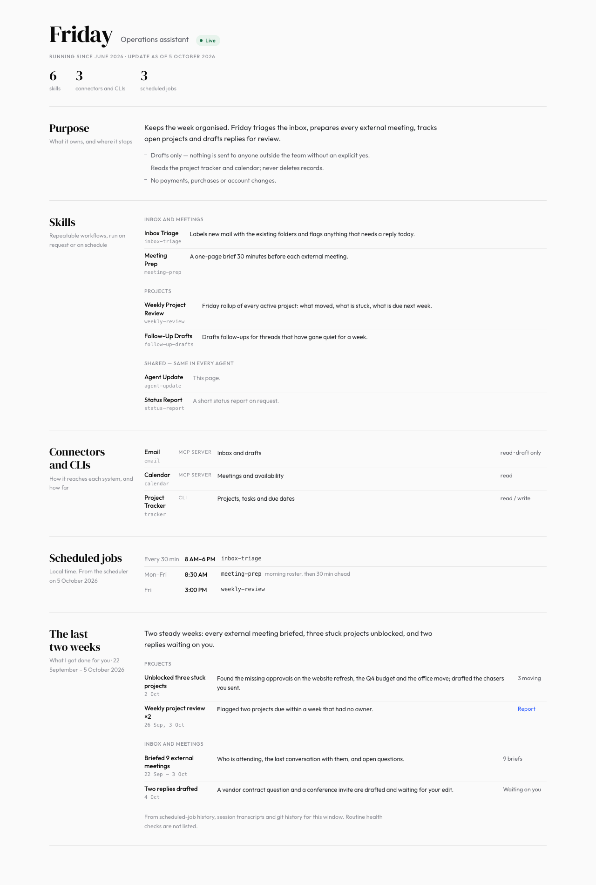

# agent-update

A Claude skill that has your agent write a one-page update about itself: what it is, what it owns, its skills, connectors and schedule, and **what it accomplished for you in the last two weeks**.



Ask your agent for "an agent update" or "what have you done for me in the last two weeks". It gathers evidence (git history, session transcripts, scheduled-job runs), writes the data as JSON, renders a static HTML page in a fixed layout, and hands you the link or file.

## Install

**As a Claude Code plugin**

```
/plugin marketplace add mgoh99/agent-update
/plugin install agent-update@agent-update
```

**As a plain skill**

```sh
git clone https://github.com/mgoh99/agent-update
cp -R agent-update/skills/agent-update ~/.claude/skills/
```

For other agents that support `SKILL.md` skills, copy `skills/agent-update` into their skills folder.

## Try the renderer

Python 3, standard library only:

```sh
python3 skills/agent-update/scripts/build.py skills/agent-update/references/example.json /tmp/agent-update.html
```

## What's inside

| Path | Purpose |
| --- | --- |
| `skills/agent-update/SKILL.md` | Instructions the agent follows |
| `skills/agent-update/scripts/build.py` | Renders the JSON into the page |
| `skills/agent-update/assets/style.css` | The page design |
| `skills/agent-update/references/example.json` | Data shape, with fictional sample data |

The sample agent "Friday" and everything it did are made up.

## License

MIT
